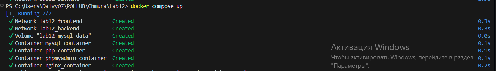
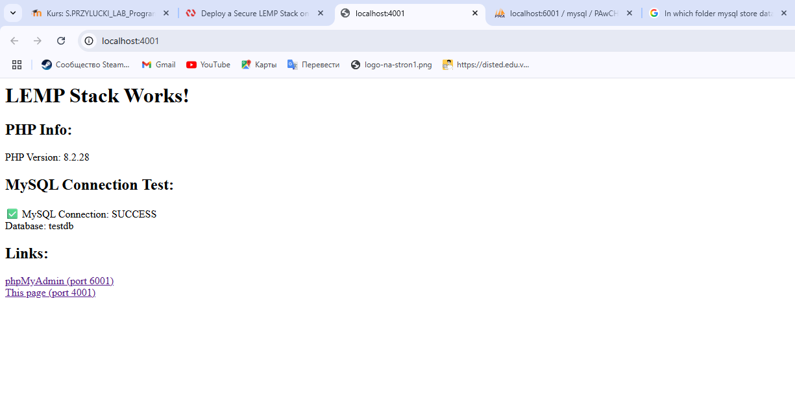
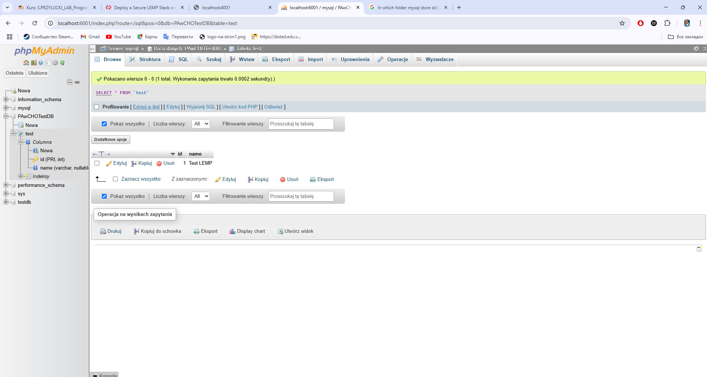
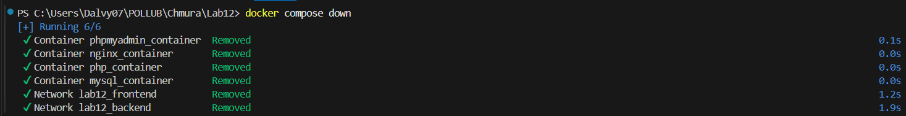

# LEMP Stack - Docker Compose

## Uruchomienie
```bash
docker-compose up -d
```

## Wyłączanie
```bash
docker-compose down     # Zachowuje dane
docker-compose down -v  # Usuwa dane
```

## Inne środowiska
```bash
docker-compose -f docker-compose.base.yml -f docker-compose.override.yml up -d
```

## Dostęp
- **LEMP Stack**: http://localhost:4001
- **phpMyAdmin**: http://localhost:6001 (root/root123)

## Dowód wykonania

### 1. Uruchomienie stacku


### 2. Strona LEMP działa (port 4001)


### 3. phpMyAdmin dostępny (port 6001)


### 4. Zatrzymanie stacku


## Wymagania ✅
- 4 kontenery: nginx:1.25, php:8.2-fpm, mysql:8.0, phpmyadmin:latest
- Sieci: backend (PHP, MySQL), frontend+backend (Nginx, phpMyAdmin)
- Porty: 4001 (Nginx), 6001 (phpMyAdmin)
- Funkcjonalność: strona PHP, zarządzanie bazą MySQL
